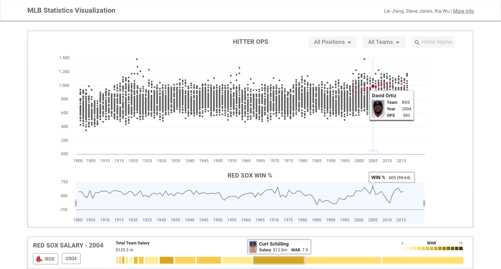

# How To Build a Personal Website
###### Guides & Resources for Building a Portfolio Website to Help Land a Software Engineering Position

### Summary
#### Link to other page on this website which is a project

  <a href="portfolio/mlbstatvis">
  

    

      

        <h4>MLB Statistics Visualization</h4>
        

        <h6>Design & Dev of a D3 info-vis for MLB stats</h6>
      

    

    
  

</a>

#### Link to a pdf

  

    

      

        <h4>Undergrad Honors Thesis</h4>
        

        <h6>UX Research of the Floating Action Button</h6>
      

    

    
  

#### Link to other page on another website

  

    

      

        <button type="button" class="close" data-dismiss="modal" aria-hidden="true">&times;</button>
        <h4 class="modal-title">How To Build a Personal Website</h4>
        <h6 class="modal-title-description">8 Article Guide to Help Build a Personal Website</h6>
      

      

        

          
        

        

        
<a href="https://github.com/Steve-Jones/Steve-Jones.github.io/blob/master/README.md" target="_blank" id="visit-btn">Read Articles</a>

      

      

        <button type="button" class="btn btn-default" data-dismiss="modal">Close</button>
      

    

  

